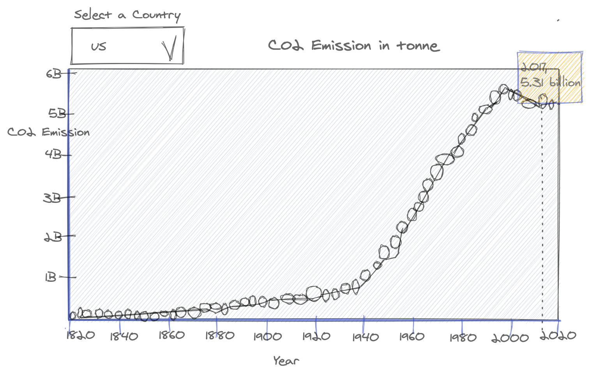

# CO2 Emissions in tonnes 

In this project, I want to show that how the CO2 emmissions from burning of fossil fuel have changed over the years.
To demostrate the change, I sketched the following time-sreies line graph that shows the CO2 emissions over the years. 

  
  The data is obtained from the website, [Kaggle.](https://www.kaggle.com/yoannboyere/co2-ghg-emissionsdata)
The data source is [Our world in data.](https://ourworldindata.org/co2-and-other-greenhouse-gas-emissions)

