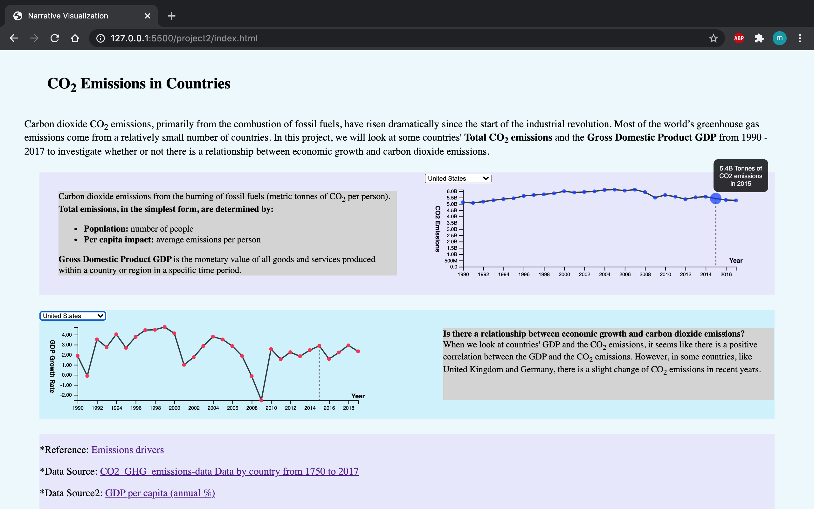
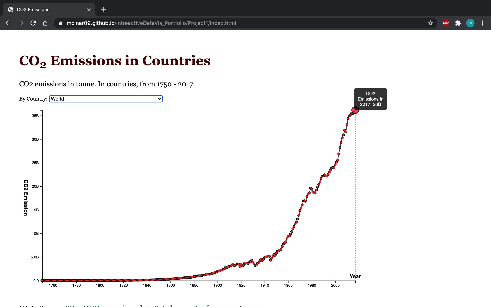
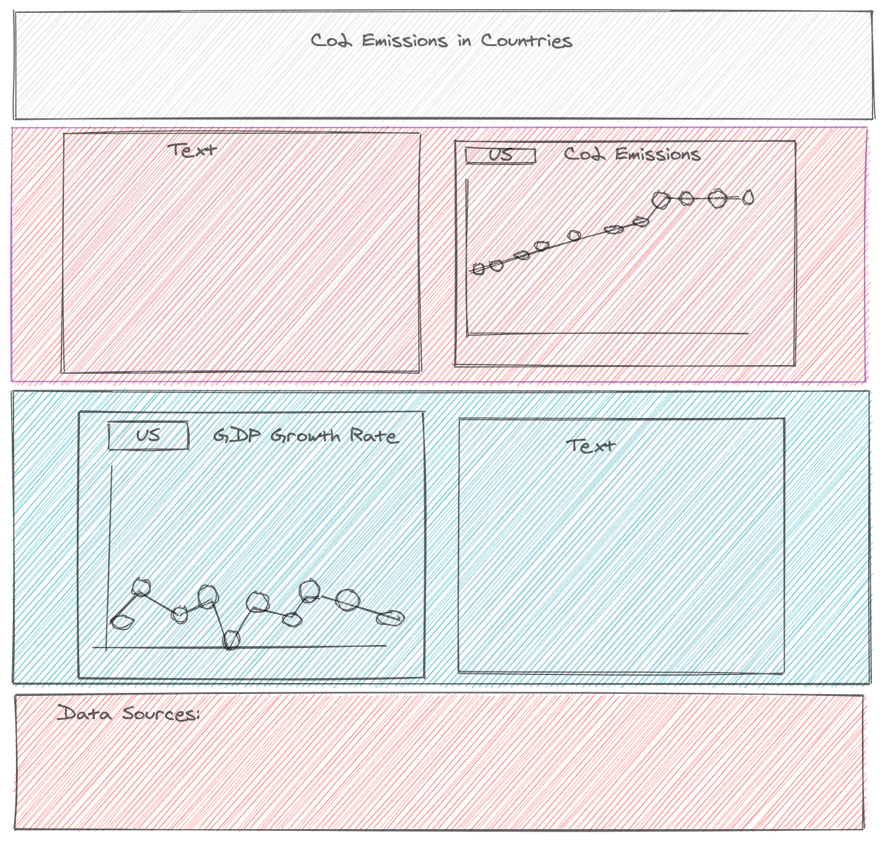
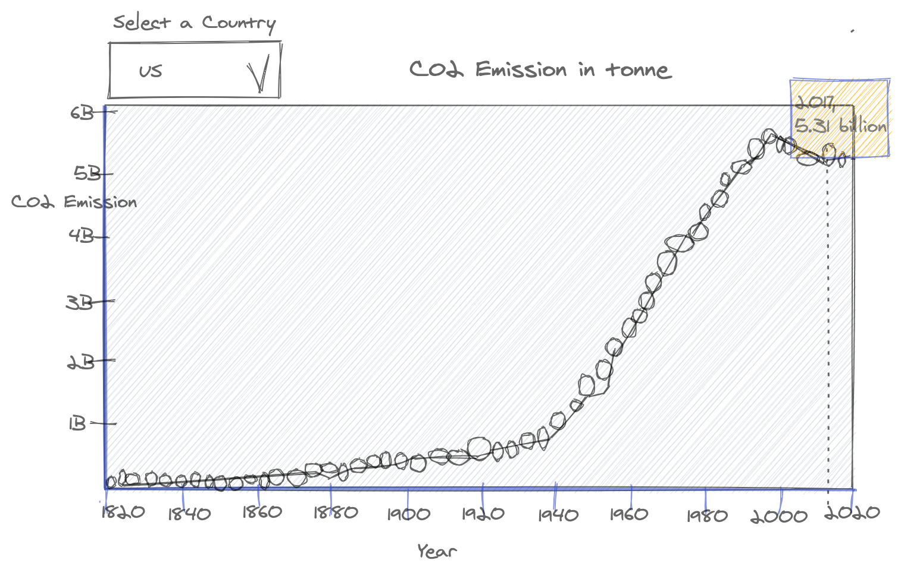

## Visualization Portfolio
I created this portfolio as a part of my class, Interactive Data Visualizations in Fall 2020 at CUNY Graduate Center.
 
***********
 
Carbon dioxide CO2 emissions, primarily from the combustion of fossil fuels,have risen dramatically since the start of the industrial revolution. Most of the world’s greenhouse gas emissions come from a relatively small number of countries. In this project, we will look at some countries' <b>CO2 emissions</b> and the <b>Gross Domestic Product GDP</b> from 1990 - 2017 to investigate whether or not there is a relationship between economic growth and carbon dioxide emissions.
 
 [ <b>CO2 emissions</b> vs. <b>Gross Domestic Product GDP</b> ](https://mcinar09.github.io/IntreactiveDataVis_Portfolio/Project2/index.html)
  
  
   
   
The data souces:  
[Kaggle.](https://www.kaggle.com/yoannboyere/co2-ghg-emissionsdata)  
[Our world in data.](https://ourworldindata.org/co2-and-other-greenhouse-gas-emissions)  
[The World Bank, GDP per capita](https://data.worldbank.org/indicator/NY.GDP.PCAP.KD.ZG) 

 
In my first exploratory project, I looked at the 

[ <b>Total CO2 emissions</b> from 1950-2017 in Countries. ](https://mcinar09.github.io/IntreactiveDataVis_Portfolio/Project1/index.html)

 
My Prospectus:

  
 